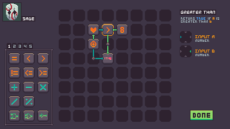

    [Watch or listen to the video version of this article](https://www.youtube.com/watch?v=TOmmutd6rTw)

Have you ever had an idea worm its way into your mind and refuse to leave?

 
<i>Dawnbreaker today (written in Rust)</i>

That's what happened to me back in 2019 when I was playing Minecraft and came across a mod called [Psi](https://psi.vazkii.net) - created by Vazkii; also the author of Botania.

Psi has a spell crafting grid that is used to create _Tricks_ that can be loaded into a cartridge and fired with a gun.
These _Tricks_ can be extremely complex, with varying effects ranging from simply damaging an enemy to automatically building structures.
They are like macros for a bunch of stuff you may want to do in Minecraft.

 
<i>Psi's spell crafting grid</i>

It looks complicated, especially due to Minecraft's icon size limitations. It's basically visual scripting.

When playing with this mod, I thought it'd be cool if games like Final Fantasy XII or Dragon Age Origins - which have auto-battle mechanics, had something as complex as this for their AI.

## The premise

A tactics auto-battler game in which the player characters must have their behaviour programmed before battle.

The tactics for a party member is programmed by the player. The tactics grid consists of a number of pieces that can be connected via matching input and output types.

For example, the "Max HP" piece takes one parameter, a Unit and outputs a Number - the maximum health of the unit that was given.

Each party member can have three active tactics grids at a time, and there are special pieces to switch between grids.

You play as a fixer - someone who sets up and pulls off high stakes jobs like heists - in a cyberpunk future.

## The joruney thus far

The path from the conception of the idea to today is labyrinthine and spans five programming languages (C#, Elm, C, Zig, Rust) and many more failed attempts.

Wanting to scratch my own itch, I jumped in the deep end in late 2019. It was smooth sailing in the beginning and I soon had a console-only (as in CLI) prototype written in C# up and running, simulating battles.

Unfortunately, I don't have any builds or screenshots from that time, but since it was a text user interface, there would be not much to show.

When the notion of adding graphics came up, I considered using Unity. Being a dumb hipster, I decided that was too mainstream and I wanted to learn something new. I had been hearing about this thing called "Functional Programming" and since I was working as a web developer - decided to use Elm.

I got the tactics screen implemented with a hex grid, a simple town screen and that's about it.

 
<i>Tactics screen in the Elm version</i>

As you can see, I opted for a hexagonal grid rather than a square one like Psi. Hexagons look nice and it gives an oppourtunity for any pieces that have more than three parameters to exist.

## The first stop of production

It's hard to remember exactly why, but I changed my mind and went to Unity after this. However, Unity was - at the time - not that great for pixel art, and had a bunch of usability issues that left me sour about using it pretty quickly.

The project would sit untouched for about a year.

## The gamejam version - in C this time

 
<i>Game jam version mockup</i>

At some point in 2020 I decided that I wanted to learn "real" programming and started learning C. That's also when I started [my YouTube channel](https://youtube.com/@DylanFalconer0) about programming.

After some months of learning C and OpenGL, I decided to enter a gamejam and test my skills.

I entered the One-Month Turn-Based Jam and submitted [a working (albeit unpolished) version](https://falconerd.itch.io/auto-battle-tactics) of the tactics and a battle.

## The first C attempt

After the jam, I decided to build out the game for real. I took some bits of the code from the jam (it is very messy - it's included in the zip when you download the game) and got started.

It wasn't too long before I got sick of segfaults and thought that perhaps I'm not good enough to use a language like C.

## The first Zig attempt

Alright, Zig! A low-ish level language that has manual memory management but isn't so esoteric!

After some weeks or months working in Zig, I decided that "actually... I should learn C properly - using Zig is just a crutch for my lack of knowledge".

This is when I started buying books like K&R and Computer Systems: A Programmer's Perspective.

I didn't make it very far through these books - I still plan to, I just haven't set aside the time.

Regardless, my mindest was now that I should stop using the crutch that is Zig, and switch back to C.

## The second C attempt

I busied myself implementing a bunch of parsing code for custom data types, getting lost in the minutiae of pretty much everything.

It wasn't long before the annoyances of certain missing features lead me back to Zig.

## The second Zig attempt

And so I found myself back at Zig.

You may notice that the past four versions don't have any screenshots.

This is because I was spending all my time doing pointless re-implementations of things I had already done.

The rationalisation-engine in my brain was at full-steam.

Each of these four attempts were on-and-off - my work ethic was abysmal.

There was an outside chance this project would ever see the light of day. 

## Where are we now?

Today, the engine has been re(-re-re-re-re...)-written in Rust and the scope of features is similar to the Elm version from 2019.

There are some cool things about how the engine all fits together that I think would make interesting topics - so I'll be posting about those.

This is the first of weekly devlogs until the game ships and beyond.

I hope you can use this train-wreck as a cautionary tale. Thank you for reading, and see you soon.

You can discuss this article on [Twitter](https://twitter.com/falconerd_/status/1620469081064501248?s=20&t=ChPyZyzoqejC3-p5c7QFMw).

